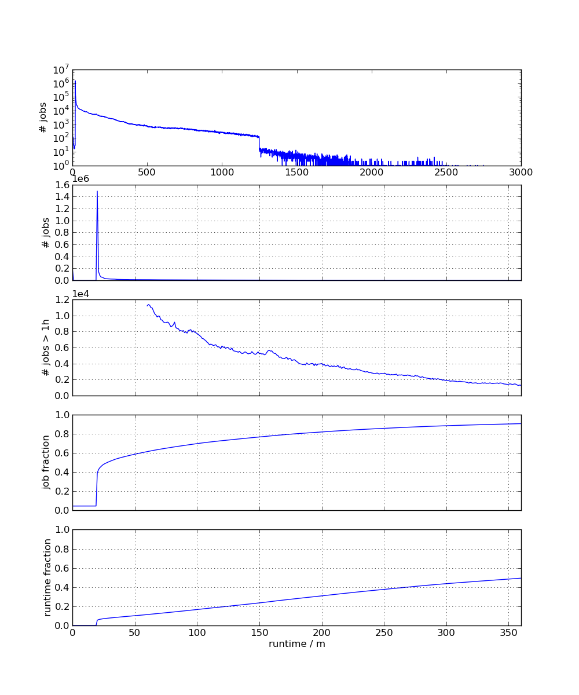
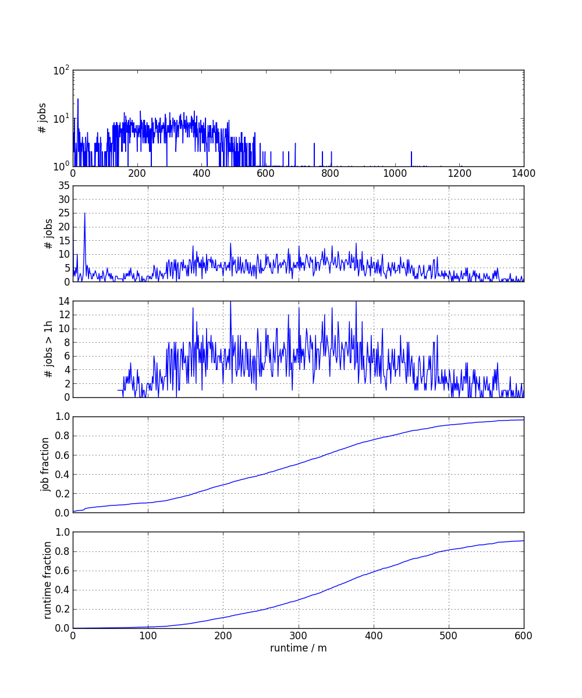

# CRAB3 Job Runtime Analysis

Scripts to illustrate the benefits of reducing the user input by removing
splitting options and replacing them with a single time parameter.  Job
runtimes of all CRAB3 jobs:

With automatic splitting:

